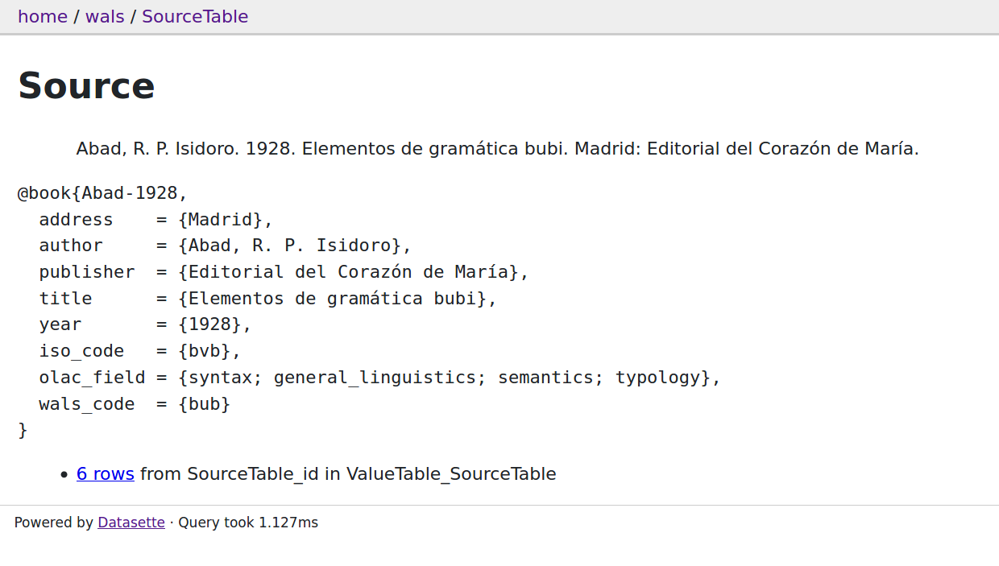

# datasette-cldf

[Datasette](https://datasette.readthedocs.io/en/stable/) plugin to explore CLDF datasets

[](https://travis-ci.org/cldf/datasette-cldf)
[](https://codecov.io/gh/cldf/datasette-cldf)
[](https://pypi.org/project/datasette-cldf)


[CLDF](https://cldf.clld.org) datasets can be easily loaded into SQLite databases 
(running the `cldf createdb` command provided with [`pycldf`](https://pypi.org/project/pycldf)). Thus, they can be readily explored via the web interface provided by
datasette.

This plugin exploits the "semantics" of CLDF to customize datasette, e.g. to display
[glottocode](https://cldf.clld.org/v1.0/terms.rdf#glottocode) columns as hyperlinks to https://glottolog.org or to display rows of an [`ExampleTable`](https://github.com/cldf/cldf/tree/master/components/examples) component as interlinear glossed text, i.e. with
aligned morphemes and glosses.


## Usage

`datasette-cldf` customizes datasette by providing
- custom [datasette metadata](https://datasette.readthedocs.io/en/stable/metadata.html)
- custom templates
- and custom configuration.

Thus, instead of calling the `datasette` cli directly, ỳou call the `datasette.serve` subcommand, which this package registers with [`cldfbench`](https://github.com/cldf/cldfbench/blob/master/README.md#commands):
```shell script
cldfbench datasette.serve PATH/TO/cldf-metadata.json
```


## Features

We'll show the customizations provided by this plugin with a series of screenshots
of datasette serving the [World Atlas of Language Structures](https://github.com/cldf/cldfbench/blob/master/README.md#commands).

- Languages are displayed on a map


- Language details also show a map


- and link to feature values of the language


- Feature pages list possible values and their distribution


- Sources are formatted according to the [Unified Style Sheet](https://www.linguisticsociety.org/resource/unified-style-sheet) and as BibTeX records



- Examples are formatted as interlinear glossed text according to the [Leipzig Glossing Rules](https://www.eva.mpg.de/lingua/resources/glossing-rules.php)


